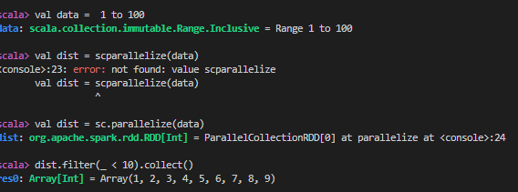
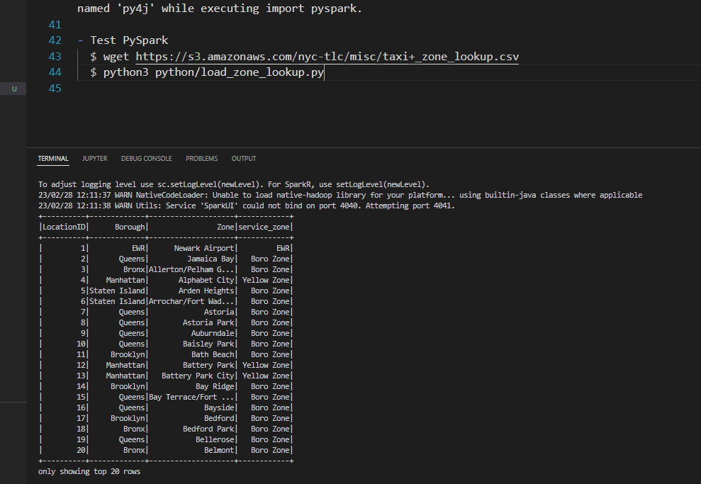
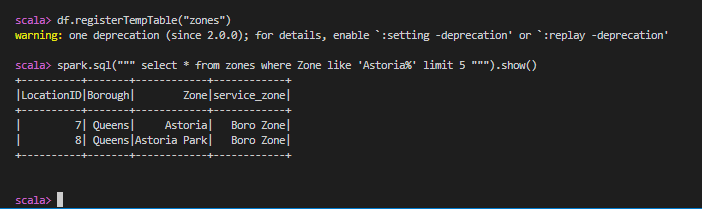
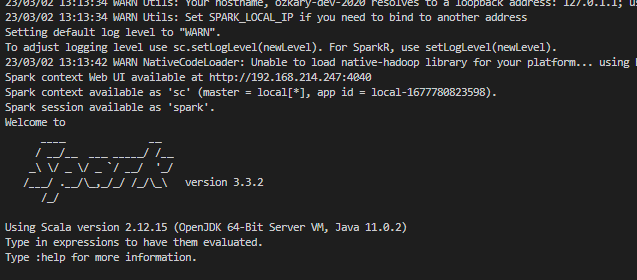

# Batch Processing with Apache Spark


[Source Code](python/)

### Install Java
```
$ cd ~/
$ mkdir spark
$ cd spark
$ wget https://download.java.net/java/GA/jdk11/9/GPL/openjdk-11.0.2_linux-x64_bin.tar.gz
$ tar xzfv openjdk-11.0.2_linux-x64_bin.tar.gz
```

- Permanently add the path to the shell configuration 
```
$ nano ~/.bashrc

export JAVA_HOME="${HOME}/spark/jdk-11.0.2"
export PATH="${JAVA_HOME}/bin:${PATH}"
```
- Save the file open a new bash and terminal check the version. 

```
$ java --version
```

### Install Spark
```
$ wget https://dlcdn.apache.org/spark/spark-3.3.2/spark-3.3.2-bin-hadoop3.tgz
$ tar xzfv spark-3.3.2-bin-hadoop3.tgz
$ rm spark-3.3.2-bin-hadoop3.tgz
```
- Add the variables to the path using the  ~/.bashrc file

```
export SPARK_HOME="${HOME}/spark/spark-3.3.2-bin-hadoop3"
export PATH="${SPARK_HOME}/bin:${PATH}"

```

- Run a quick test 
Run spark-shell and run the following:

```
val data = 1 to 10000
val distData = sc.parallelize(data)
distData.filter(_ < 10).collect()
```



### Configure PySpark Path

- To run PySpark, we first need to add it to PYTHONPATH using the  ~/.bashrc file

**Note: Validate the name of the py4j* file**

```
export PYTHONPATH="${SPARK_HOME}/python/:$PYTHONPATH"
export PYTHONPATH="${SPARK_HOME}/python/lib/py4j-0.10.9.5-src.zip:$PYTHONPATH"
```

**Note: Make sure that the version under ${SPARK_HOME}/python/lib/ matches the filename of py4j or you will encounter ModuleNotFoundError: No module named 'py4j' while executing import pyspark.**

### Test PySpark

Download the csv file into the data folder and run the python script

```
  $ spark-shell
  $ wget https://s3.amazonaws.com/nyc-tlc/misc/taxi+_zone_lookup.csv
  $ python3 python/load_zone_lookup.py

```  

- PySpark Load Zones


- Test Scale SQL


## Homework

- Download the test data

```
$ cd python
$ python web_to_local.py --prefix=fhvhv_tripdata --year=2021 --month=6 --url=https://github.com/DataTalksClub/nyc-tlc-data/releases/download/fhvhv
```

- Create the Spark session and read the version

```

spark = SparkSession.builder \
    .master("local[*]") \
    .appName('process-taxi-data') \
    .getOrCreate()

# Q1 spark version
print(f"Spark Version - {spark.version}")

```

- Create the parquet files with 12 partitions

```

schema = types.StructType([
    types.StructField('hvfhs_license_num', types.StringType(), True),
    types.StructField('dispatching_base_num', types.StringType(), True),
    types.StructField('pickup_datetime', types.TimestampType(), True),
    types.StructField('dropoff_datetime', types.TimestampType(), True),
    types.StructField('PULocationID', types.IntegerType(), True),
    types.StructField('DOLocationID', types.IntegerType(), True),
    types.StructField('SR_Flag', types.StringType(), True),
    types.StructField('Affiliated_base_number', types.StringType(), True)
])
#  Load the dataframe
file_path = '../data/fhvhv_tripdata/fhvhv_tripdata_2021-06.csv.gz'
print(f"Reading - {file_path}")

df = spark.read \
    .option("header", "true") \
    .schema(schema) \
    .csv(file_path)

#  Partition the data frame
folder_path = '../data/fhvhv'
print(f"Creating partitions - 12 folder {folder_path}")
df.head()
df = df.repartition(12)
df.write.mode('overwrite').parquet(folder_path, compression='gzip')

```

- Using the terminal, check the size of the files and write to a log file

```
$ ls -al ../data/fhvhv/*.parquet >>  size.log
```


- Q3: How many taxi trips were there on June 15 2021?

```
pickup_dt = '2021-06-15'
from pyspark.sql import functions as F
df \
    .withColumn('pickup_date', F.to_date(df.pickup_datetime)) \
    .filter(f"pickup_date = {pickup_dt}") \
    .count()

# using SQL syntax

df.createOrReplaceTempView('fhvhv_tripdata')
spark.sql(f"""
SELECT
    COUNT(1)
FROM 
    fhvhv_tripdata
WHERE
    to_date(pickup_datetime) = {pickup_dt};
""").show()
```

- Q4: Longest trip for each day

```
df.columns
['hvfhs_license_num',
 'dispatching_base_num',
 'pickup_datetime',
 'dropoff_datetime',
 'PULocationID',
 'DOLocationID',
 'SR_Flag']
df \
    .withColumn('duration', (df.dropoff_datetime.cast('long') - df.pickup_datetime.cast('long'))/( 60 * 60 )) \
    .withColumn('pickup_date', F.to_date(df.pickup_datetime)) \
    .groupBy('pickup_date') \
        .max('duration') \
    .orderBy('max(duration)', ascending=False) \
    .limit(5) \
    .show()

spark.sql("""
SELECT
    to_date(pickup_datetime) AS pickup_date,
    MAX((CAST(dropoff_datetime AS LONG) - CAST(pickup_datetime AS LONG)) / (60 * 60)) AS duration
FROM 
    fhvhv_tripdata
GROUP BY
    1
ORDER BY
    2 DESC
LIMIT 5;
""").show()
```

- Q5 Spark’s User Interface which shows application's dashboard runs on which local port?



- Q6 Using the zone lookup data and the fhvhv June 2021 data, what is the name of the most frequent pickup location zone

```
zones_path = '../data/zones'
df_zones = spark.read.parquet(zones_path)
df_zones.columns
['LocationID', 'Borough', 'Zone', 'service_zone']

df_zones.createOrReplaceTempView('zones_data')
spark.sql("""
SELECT
   pul.Zone,
   COUNT(1) as Total
FROM 
    fhvhv_tripdata fhv 
    INNER JOIN zones_data pul ON fhv.PULocationID = pul.LocationID    
GROUP BY 
    1
ORDER BY
    2 DESC
LIMIT 5;
""").show()
```