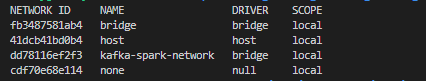
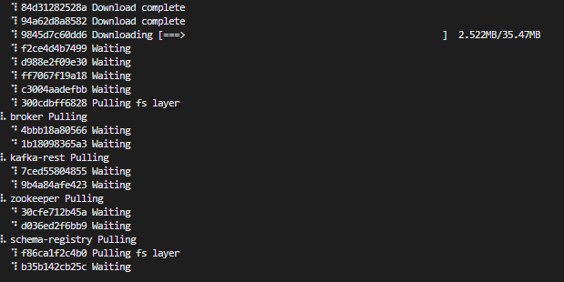

# Data Streaming with Kafka

[Python Code](python/)

Kafka is a distributed event store and stream processor for large volumes of data and real-time integrations.

## Kafka Actors
- topic
- consumer
- producer

### Topic configurations

- retention.ms: due to storage space limitations, messages can't be kept indefinitely. This setting specifies the amount of time (in milliseconds) that a specific topic log will be available before being deleted.
- cleanup.policy: when the retention.ms time is up, we may choose to delete or compact a topic log.
- partition: number of partitions.
The higher the amount, the more resources Kafka requires to handle them. Remember that partitions will be replicated across brokers; if a broker dies we could easily overload the cluster.
- replication: replication factor; number of times a partition will be replicated.

### Consumer Configuration

- offset: sequence of message IDs which have been read by the consumer.
- consumer.group.id: ID for the consumer group. All consumers belonging to the same group contain the same consumer.group.id.
- auto_offset_reset: when a consumer subscribes to a pre-existing topic for the first time, Kafka needs to figure out which messages to send to the consumer.
   - earliest: all of the existing messages in the topic log will be sent to the consumer
   - latest: existing old messages will be ignored and only new messages will be sent to the consumer.

### Producer Acknowledgement Settings

- Acks = 0

No response is requested from the broker, so if the broker goes offline or an exception happens, we will not know and will lose data. Useful for data where it's fine to potentially lose messages as metric or log collection.

The best performance is this because the producer will not wait for any confirmation.

- Acks = 1 (Default)

Leader response is requested, but replication is not guarantee, this happens in background. If an acknowledgement is not received, the producer could retry without duplicate data. If the leader broker goes offline but replicas haven't replicated the data yet, we have data lost.

- Acks = all

The leader and the replicas are requested by acknowledgement, this means that the producer has to wait to receive confirmation of any replica of the broker before to continue, this add latency but ensures safety, this setting ensure no lose data.

[Kafka Consumer Configuration](https://docs.confluent.io/platform/current/installation/configuration/consumer-configs.html)

[Kafka Producer Configuration](https://docs.confluent.io/platform/current/installation/configuration/producer-configs.html)

##  Streams vs State

- Streams (KStreams) are individual messages that are read sequentially.
- State (KTable) similar to a stream changelog table, which contains a view of the stream at a specific point of time
  - KTables are also stored as topics in Kafka.

Kafka Streams provides a series of features which stream processors can take advantage of, such as:

- Aggregates (count, groupby)
- Stateful processing (stored internally in a Kafka topic)
- Joins (KStream with Kstream, KStream with KTable, Ktable with KTable)
- Windows (time based, session based)
  - A group of records that have the same key meant for stateful operations such as aggregations or joins


## Setup Kafka Locally
```
# Create Network
$ docker network  create kafka-spark-network
$docker network list

```


```
# Start Docker-Compose (within the kafka folder)
# cd kafka
$ docker compose up -d
# stop docker
// $ docker compose down

```


## Setup Python Environment for kafka
```
$ pip install confluent-kafka configparser

```
